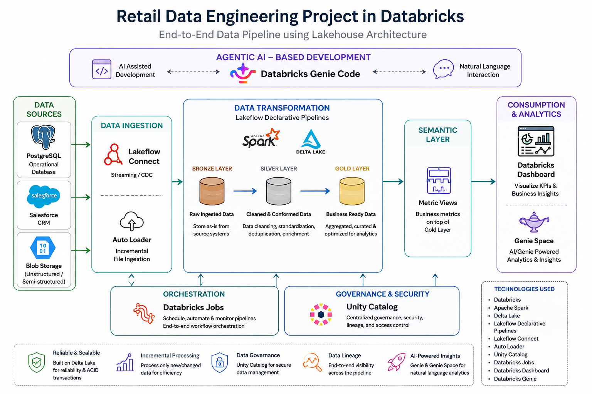

# Retail Data Engineering Project – Databricks

## 📌 Project Overview

This project implements an end-to-end **retail data engineering and analytics pipeline** using **Databricks**.

The solution integrates data from multiple sources including **PostgreSQL, Salesforce, and Blob Storage**, processes the data through a **Medallion Architecture (Bronze, Silver, and Gold)** using **Lakeflow Declarative Pipelines and Delta Lake**, and exposes the curated data through **Metric Views and Databricks Dashboards**.

The project also incorporates **Unity Catalog for governance**, **Databricks Jobs for orchestration**, and **Databricks Genie/Genie Space for natural-language analytics**.

## 🏗️ Architecture



### End-to-End Data Flow

```text
PostgreSQL ───────┐
                  │
Salesforce ───────┼──→ Data Ingestion
                  │       │
Blob Storage ─────┘       ↓
                    Lakeflow Connect
                       / Auto Loader
                           │
                           ↓
                       Bronze Layer
                           │
                           ↓
                       Silver Layer
                           │
                           ↓
                        Gold Layer
                           │
                           ↓
                       Metric Views
                           │
                           ↓
                 Databricks Dashboard
                           │
                           ↓
                    Genie / Genie Space
```

## 🔹 Data Sources

The project works with multiple types of data sources:

* **PostgreSQL** – relational transactional data
* **Salesforce** – CRM/business data
* **Blob Storage** – file-based data

This demonstrates ingestion from both **database and file-based sources**.

## 🔹 Data Ingestion

The ingestion layer uses Databricks-native ingestion capabilities:

* **Lakeflow Connect** for source-system connectivity
* **Auto Loader** for file-based ingestion
* Incremental ingestion where applicable
* Data is ingested into the Bronze layer for downstream processing

The objective of the ingestion layer is to reliably bring source data into the Databricks environment while minimizing unnecessary reprocessing.

## 🥉 Bronze Layer

The Bronze layer stores the ingested data in its raw or minimally transformed form.

Key objectives:

* Preserve source data
* Maintain the original structure as much as practical
* Support incremental ingestion
* Provide a reliable foundation for downstream transformations

The Bronze layer uses **Delta Lake**.

## 🥈 Silver Layer

The Silver layer contains cleaned and transformed data.

Typical processing includes:

* Data cleansing
* Handling missing/invalid values
* Deduplication
* Standardization
* Applying transformation and business rules
* Preparing data for analytical processing

The result is a cleaner and more consistent representation of the source data.

## 🥇 Gold Layer

The Gold layer contains business-ready and analytics-ready data.

It is designed to support:

* Business reporting
* Aggregations
* Analytical queries
* Dashboard consumption
* Metric definitions

The Gold layer acts as the primary serving layer for downstream analytics.

## 📊 Semantic Layer

The project uses **Databricks Metric Views** to provide a semantic layer over the curated data.

Metric Views help define reusable business metrics and provide a consistent way to consume analytical data.

```text
Gold Tables
     ↓
Metric Views
     ↓
Business Metrics
     ↓
Dashboard / Genie
```

## 📈 Databricks Dashboard

The Gold layer and Metric Views are consumed by a **Databricks Dashboard** to provide business-oriented visualizations and insights.

The dashboard is included in the `Dashboard/` directory.

The dashboard demonstrates how transformed data can be exposed to business users instead of requiring them to query the underlying data directly.

## 🤖 Databricks Genie

The project also includes **Databricks Genie / Genie Space** for natural-language interaction with the analytical data.

Users can interact with business data using natural-language questions rather than writing SQL for every analytical requirement.

## ⚙️ Orchestration

**Databricks Jobs** are used to orchestrate the data engineering workflow.

The orchestration layer coordinates the execution of the required ingestion and transformation tasks.

Conceptually:

```text
Databricks Job
      │
      ├── Ingestion
      │
      ├── Bronze Processing
      │
      ├── Silver Processing
      │
      └── Gold Processing
```

## 🔐 Governance

**Unity Catalog** is used as the governance layer for the Databricks environment.

It provides centralized management of:

* Data assets
* Tables
* Access control
* Data discovery
* Data governance

## 🧱 Technologies Used

| Technology                     | Purpose                                            |
| ------------------------------ | -------------------------------------------------- |
| Databricks                     | Data engineering and analytics platform            |
| Apache Spark                   | Distributed data processing                        |
| Delta Lake                     | Reliable storage and transactional data management |
| Lakeflow Connect               | Source-system ingestion                            |
| Auto Loader                    | Incremental file ingestion                         |
| Lakeflow Declarative Pipelines | Data transformation pipelines                      |
| PostgreSQL                     | Source system                                      |
| Salesforce                     | Source system                                      |
| Blob Storage                   | File-based source                                  |
| Unity Catalog                  | Data governance                                    |
| Databricks Jobs                | Workflow orchestration                             |
| Metric Views                   | Semantic/metrics layer                             |
| Databricks Dashboard           | Data visualization                                 |
| Genie                          | Natural-language analytics                         |
| GitHub                         | Version control                                    |

## 📁 Repository Structure

```text
retail-data-engineering-databricks/
│
├── Dashboard/
│   └── dashboard documentation / export
│
├── ETL_Pipeline/
│   ├── Bronze
│   ├── Silver
│   └── Gold
│
├── Jobs/
│   └── Databricks job configuration
│
├── Resources/
│   └── Project resources / configuration
│
├── images/
│   └── architecture.png
│
└── README.md
```

## 🎯 Key Data Engineering Concepts Demonstrated

* End-to-end ETL/ELT pipeline development
* Multi-source data ingestion
* Incremental data processing
* Medallion Architecture
* Bronze, Silver, and Gold layers
* Delta Lake
* Spark-based transformations
* Lakeflow Declarative Pipelines
* Auto Loader
* Databricks Jobs and orchestration
* Data governance with Unity Catalog
* Semantic modeling with Metric Views
* BI and dashboard development
* Natural-language analytics with Genie
* Git-based project version control

## 🚀 Project Outcome

The project demonstrates a complete modern data engineering workflow, starting from raw data sources and ending with governed, analytics-ready data and business-facing dashboards.

It brings together **data ingestion, transformation, storage, orchestration, governance, semantic modeling, visualization, and AI-assisted analytics** within the Databricks platform.
